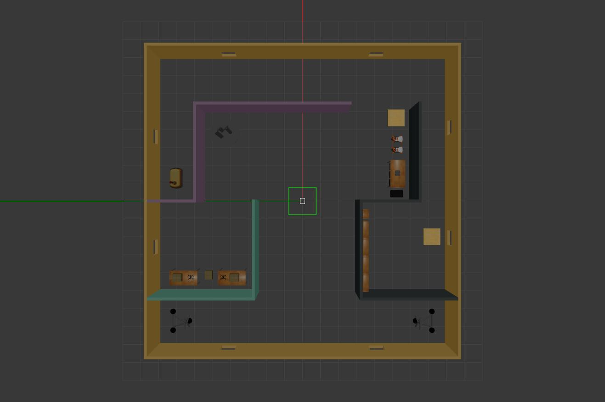

# RoboND-BuildMyWorld




In this project, a custom world was designed and tested in Gazebo. The custom world consists of a group of colored walls named basic_office, some default Gazebo models, and a custom model, a four-wheeled robot named fw_robot. The world file is written in XML format but generated via Gazebo. The world file utilizes welcome_message as a plugin. This plugin file is the compiled welcome_message.cpp. Here is a portion of the world file defining the welcome_message plugin:
```xml
  <world name='default'>
    <plugin name='welcome_message' filename='libwelcome_message.so'/>
```

## Installing the Dependencies

1. CMake
- [Click for the instructions](https://cmake.org/install/)
2. Gazebo
- [Click for the instructions](https://classic.gazebosim.org/tutorials?cat=install)
- Note: The world file was tested in Gazebo 11 on Ubuntu-20.04.

## Testing the Custom World in Gazebo
The shell script file will automatically compile and run the code on a Unix or Unix-like operating system. Use the terminal to run the script:

```bash
chmod +x run.sh
./run.sh
```

## License

This project is triple-licensed under the Apache License 2.0, the Creative Commons Attribution 3.0 Unported License, and the Creative Commons Zero v1.0 Universal (CC0 1.0) Public Domain Dedication. For more details, please refer to the [NOTICE](./NOTICE) file.
